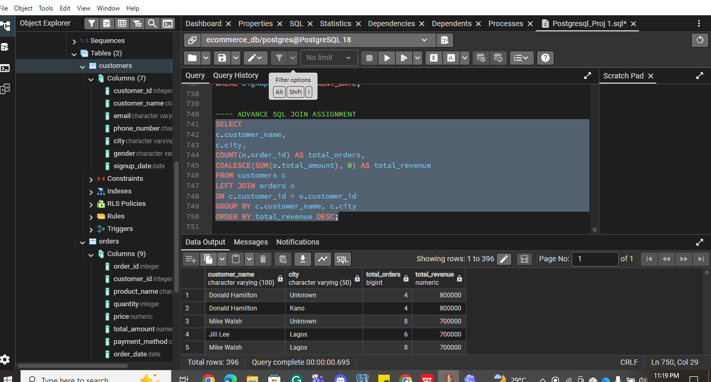
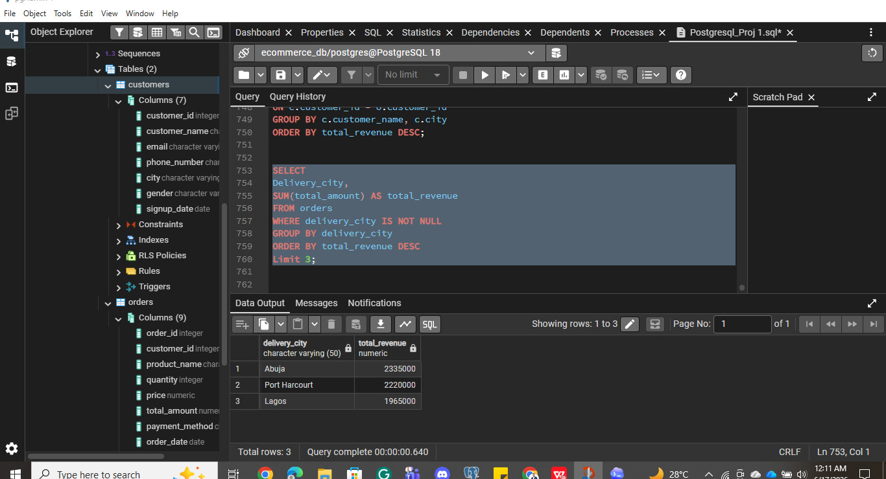
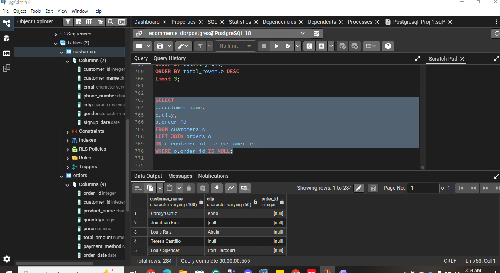
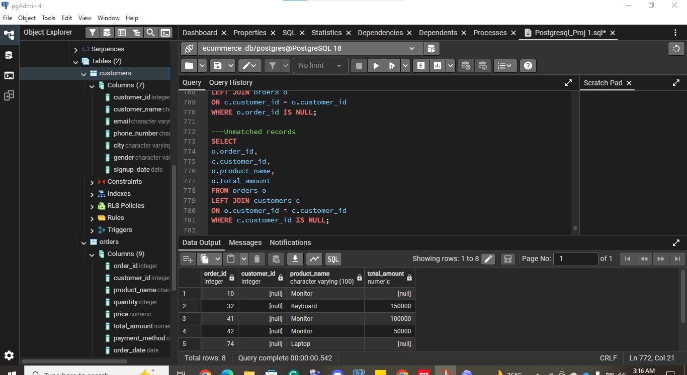
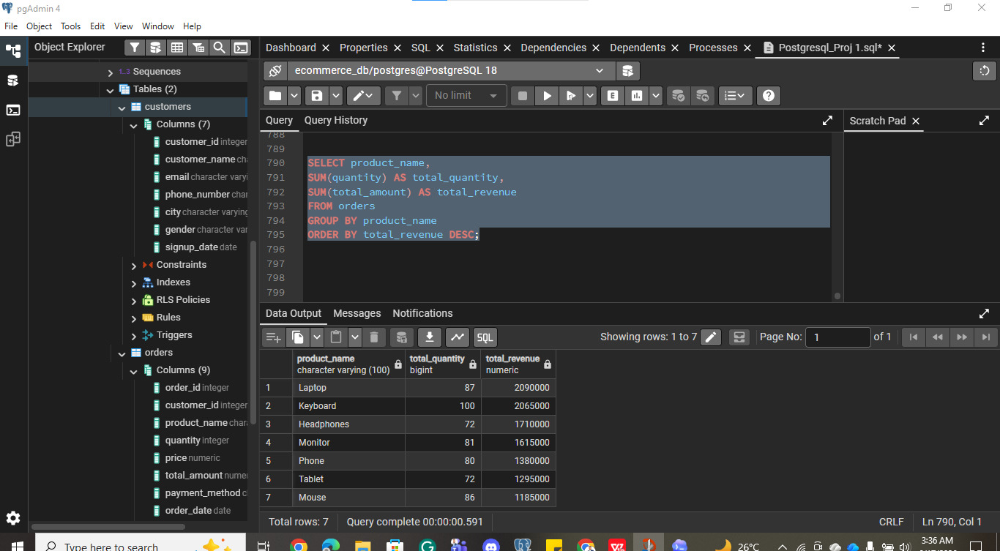
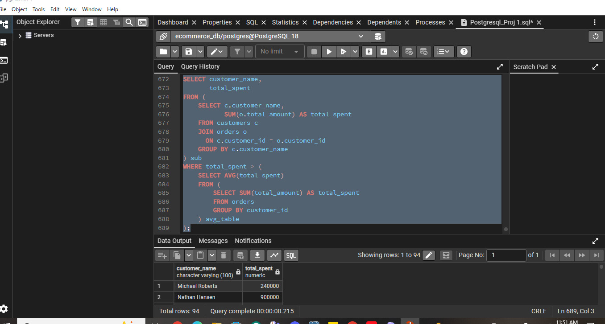
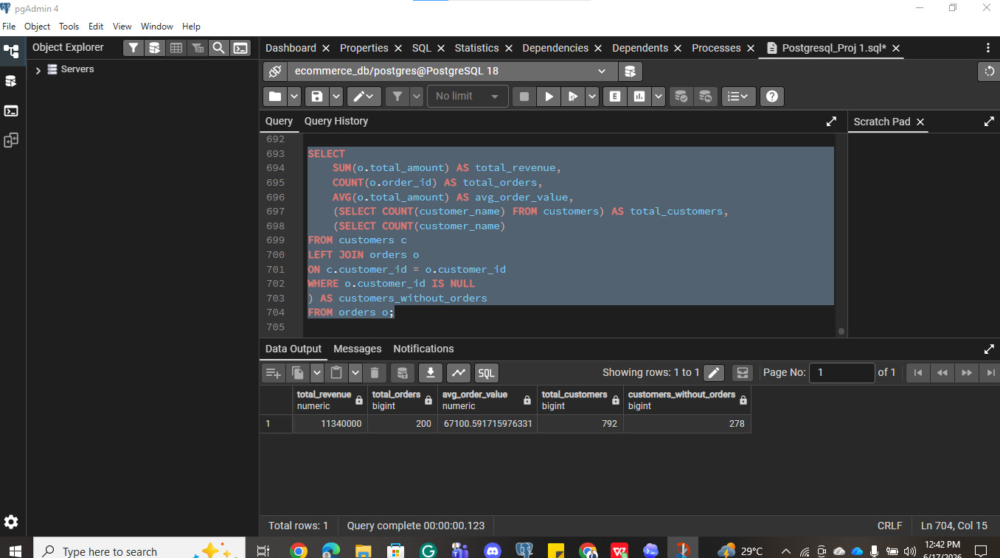

# Advanced SQL Joins & Business Analysis

Using advanced SQL joins and subqueries in PostgreSQL (pgAdmin 4) to analyze customer purchasing behavior, revenue performance, and data quality for an e-commerce company, framed as a Junior Data Analyst assignment.

## Project Overview

Management wanted a deeper understanding of customer purchasing behavior, revenue performance, and data quality issues across the Customers and Orders tables. This project uses `LEFT JOIN`, `INNER JOIN`, subqueries, and aggregate functions to build a customer performance report, surface inactive customers, catch data integrity problems, and calculate core business KPIs — then turns all of it into concrete business recommendations.

**Tools used:** PostgreSQL, pgAdmin 4

## The Data

- **Customers dataset:** `data/ecommerce_customers.csv` — customer records (customer_id, customer_name, email, phone_number, city, gender, signup_date)
- **Orders dataset:** `data/ecommerce_orders.csv` — order records (order_id, customer_id, product_name, quantity, price, total_amount, payment_method, order_date, delivery_city)

## Queries & Findings

All queries are in [`ecommerce_joins_queries.sql`](ecommerce_joins_queries.sql).

### 1. Customer performance report
Customer name, city, total orders, and total spend, ranked highest to lowest.
```sql
SELECT
    c.customer_name,
    c.city,
    COUNT(o.order_id) AS total_orders,
    SUM(o.total_amount) AS total_revenue
FROM customers c
LEFT JOIN orders o
    ON c.customer_id = o.customer_id
GROUP BY c.customer_name, c.city
ORDER BY total_revenue DESC;
```


### 2. Top 3 revenue-generating cities
```sql
SELECT
    delivery_city,
    SUM(total_amount) AS total_revenue
FROM orders
WHERE delivery_city IS NOT NULL
GROUP BY delivery_city
ORDER BY total_revenue DESC
LIMIT 3;
```


**Finding:** Abuja, Port Harcourt, and Lagos are the top 3 revenue-generating cities.

### 3. Customers who have never placed an order
```sql
SELECT
    c.customer_name,
    c.city,
    o.order_id
FROM customers c
LEFT JOIN orders o
    ON c.customer_id = o.customer_id
WHERE o.order_id IS NULL;
```


**Why this matters to marketing:** Tracking zero-order customer segments allows marketing to deploy targeted promotions and re-onboarding campaigns. Converting these inactive users directly drives retention and revenue growth.

### 4. Orders with no matching customer record (orphaned orders)
```sql
SELECT
    o.order_id,
    c.customer_id,
    o.product_name
FROM orders o
LEFT JOIN customers c
    ON o.customer_id = c.customer_id
WHERE c.customer_id IS NULL;
```


**Business impact:** These orphaned records indicate underlying data inconsistency. Left unaddressed, they can lead to incorrect reporting and revenue misattribution.

### 5. Revenue and quantity sold per product
```sql
SELECT
    product_name,
    SUM(quantity) AS total_quantity,
    SUM(total_amount) AS total_revenue
FROM orders
GROUP BY product_name
ORDER BY total_revenue DESC;
```


**Finding:** Laptop is the best-performing product, contributing 18.43% of total revenue generated.

### 6. Customers spending above the average
Calculated in three steps: total spend per customer, average customer spend, then filtering customers above that average.
```sql
SELECT customer_name,
    total_spent
FROM (
    SELECT
        c.customer_name,
        SUM(o.total_amount) AS total_spent
    FROM customers c
    JOIN orders o
        ON c.customer_id = o.customer_id
    GROUP BY c.customer_name
) sub
WHERE total_spent > (
    SELECT AVG(total_spent)
    FROM (
        SELECT SUM(total_amount) AS total_spent
        FROM orders
        GROUP BY customer_id
    ) avg_table
);
```


### 7. Core business KPIs in one query
Total revenue, total orders, average order value, total customers, and customers without orders.
```sql
SELECT
    SUM(o.total_amount) AS total_revenue,
    COUNT(o.order_id) AS total_orders,
    AVG(o.total_amount) AS avg_order_value,
    (SELECT COUNT(customer_name) FROM customers) AS total_customers,
    (SELECT COUNT(customer_name)
        FROM customers c
        LEFT JOIN orders o
            ON c.customer_id = o.customer_id
        WHERE o.customer_id IS NULL
    ) AS customers_without_orders
FROM orders o;
```


## Key Insights

1. A large share of the customer base (over a third) has never placed an order, meaning acquisition alone isn't the bottleneck — conversion of existing sign-ups is a major growth lever.
2. Orphaned order records point to a data integrity gap somewhere upstream (likely missing foreign key enforcement), which quietly distorts revenue reporting until it's caught and fixed.
3. Revenue concentration by both product (Laptop) and city (Abuja, Port Harcourt, Lagos) shows the business currently depends on a small number of strong performers rather than a broad, even base.
4. Identifying above-average spenders separately from top-order-count customers surfaces a distinct, high-value segment worth retaining specifically, rather than treating all repeat customers the same.

## Business Recommendations

1. **Target inactive customers.** Customers without orders should receive email campaigns and first-time purchase discounts to increase conversion rate and total revenue generated.

2. **Fix data quality issues.** Unmatched (orphaned) orders indicate underlying data problems. Enforcing foreign key constraints and cleaning existing records ensures more accurate reporting going forward.

3. **Focus on high-revenue products (Laptop, Keyboard, Headphones).** Promote these top performers through discounts, bundles, and targeted ads to maximize revenue growth.

4. **Invest in high-performing cities (Abuja, Port Harcourt, Lagos).** Increase ad spend and improve delivery/logistics in these regions to boost regional dominance.

5. **Reward high-spending customers.** Customers spending above the average should be offered loyalty programs and exclusive offers to improve retention and lifetime value.

## Skills Demonstrated

- `LEFT JOIN` and `INNER JOIN` to combine and compare customer and order data
- Identifying unmatched records (customers without orders, orphaned orders) using join anti-patterns
- Nested subqueries for multi-step calculations (spend per customer → average → filter)
- Combining multiple aggregate metrics and subqueries into a single KPI summary query
- Translating data quality issues into business impact statements
- Deriving actionable business recommendations from SQL analysis
- Working in PostgreSQL via pgAdmin 4
